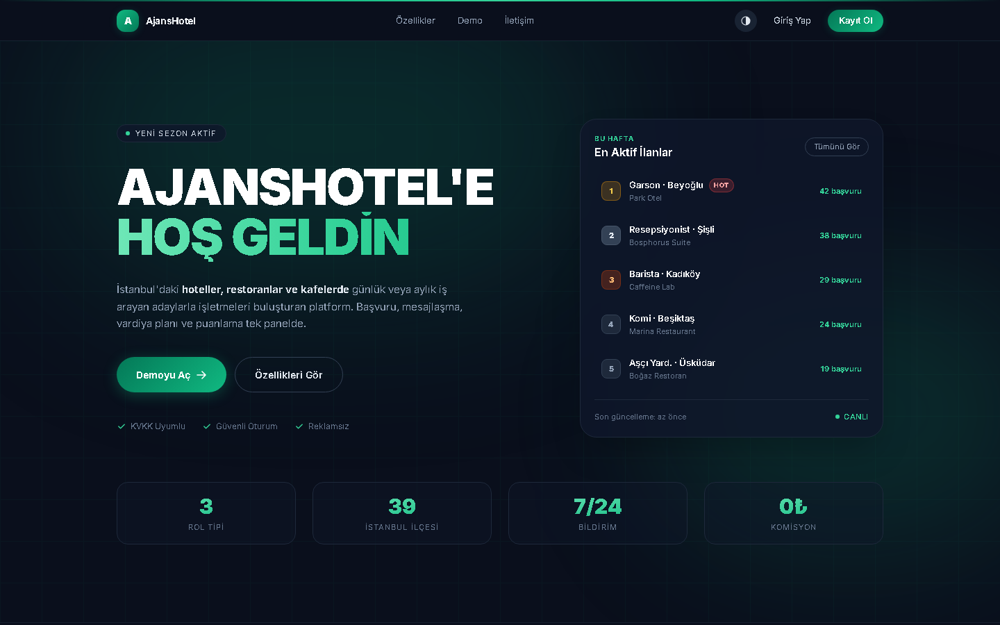
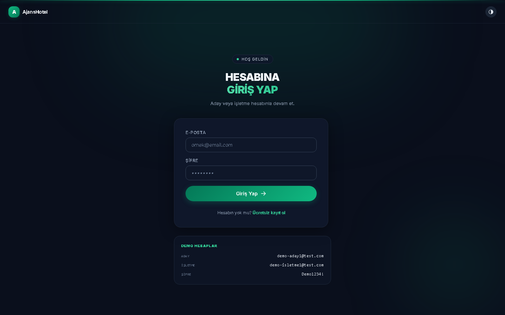
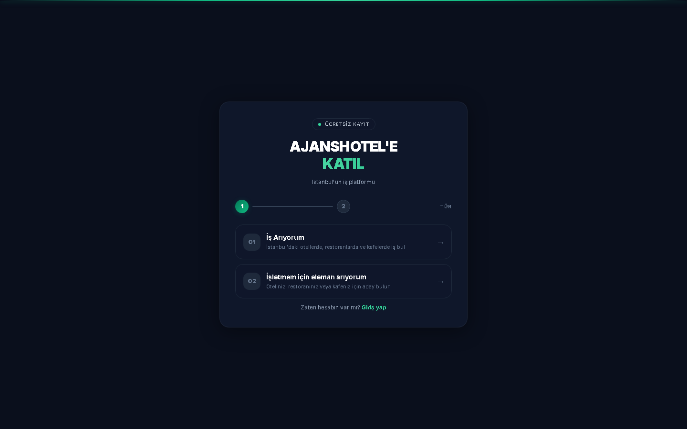
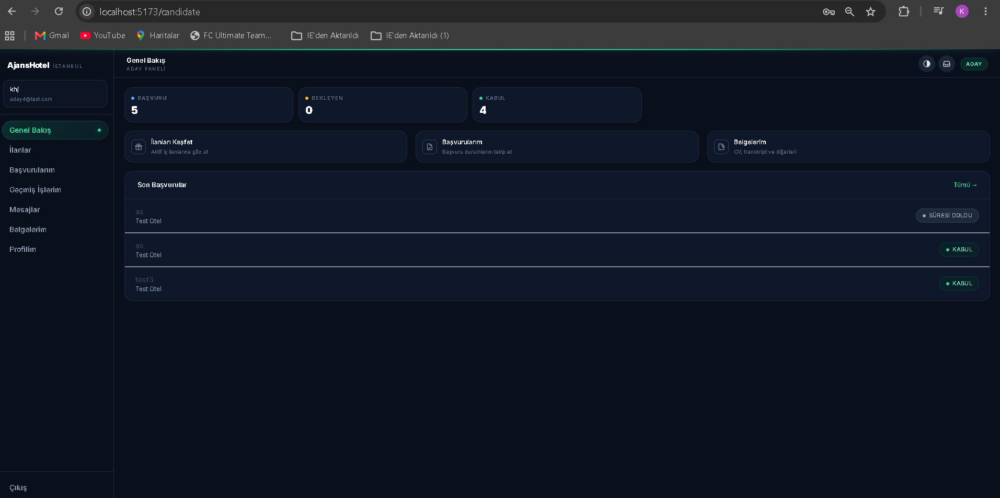
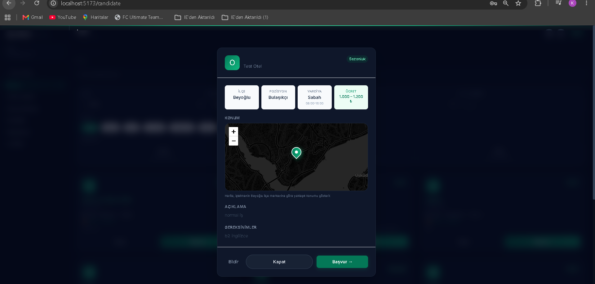
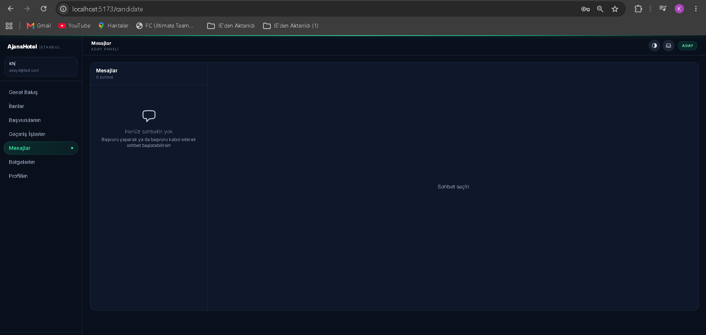
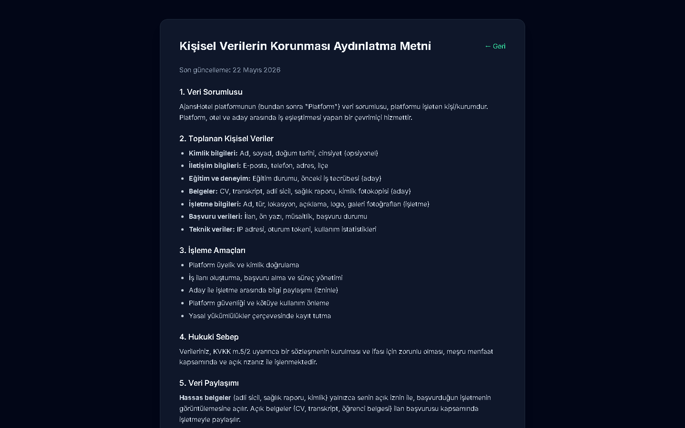

<div align="center">

# AjansHotel

**İstanbul'daki hotel, restoran ve kafelerde günlük/aylık iş arayan adaylarla işletmeleri buluşturan platform.**

Başvurudan çalışmaya kadar tüm süreç tek ekranda: ilan açma → vardiya planı → başvuru → mesajlaşma → puanlama.

[](https://hotel-platform-seven.vercel.app/)
[](https://hotel-platform-seven.vercel.app/)
[](#lisans)


</div>

---

## Canlı Demo

🌐 **<https://hotel-platform-seven.vercel.app/>**

### Demo Hesaplar

| Rol      | E-posta                    | Şifre        |
| :------- | :------------------------- | :----------- |
| Aday     | `demo-aday1@test.com`      | `Demo1234!`  |
| İşletme  | `demo-isletme1@test.com`   | `Demo1234!`  |

> Demo verisi `@Profile("demo")` ile idempotent olarak yüklenir — 9 başvuru, 3 işletme, 12 ilan içerir.

### 60 Saniyede Tur

1. **`/`** — Landing'de "Demoyu Aç" butonuna tıkla
2. **Aday olarak giriş yap** → vardiya bazlı bir ilana başvur
3. **Çıkış → İşletme olarak giriş yap** → gelen başvuruyu **Kabul Et** / **İncele** / **Reddet**
4. **Mesajlar** sekmesinde aday ile chat aç → 5 sn polling ile canlı mesajlaşma
5. **Genel Bakış**'ta donut + bar grafiklerle istatistikleri gör
6. **Tema değiştir** (sağ üst kontrast butonu): dark ↔ light

---

## Ekran Görüntüleri

> Görseller `docs/screenshots/` klasöründedir — headless Chrome ile prod'dan çekilmiştir.

### Landing — Hibrit dark tema + Wordplay tarzı dev başlık + canlı leaderboard

<p align="center"></p>

### Auth — Giriş + Kayıt (pill butonlar, dark + neon yeşil)

<table>
<tr>
<td width="50%"><b>Giriş</b><br/></td>
<td width="50%"><b>Kayıt — Rol Seçimi</b><br/></td>
</tr>
</table>

### Aday Paneli — Hibrit dark dashboard + kompakt stat strip

<p align="center"></p>

### İlan Detayı — Vardiya + ücret + **canlı harita** (#81)

<p align="center"></p>

### Mesajlaşma — 5 saniye polling + listing context

<p align="center"></p>

### KVKK — Aydınlatma metni

<p align="center"></p>

> **İşletme paneli (`stats.png`, `business-applications.png`)** ileride eklenecek — demo işletme hesabıyla
> Genel Bakış grafikleri ve Gelen Başvurular tablosu çekildiğinde bu listeye eklenir.

---

## Özellikler

### Aday Tarafı

- **Vardiya bazlı başvuru** — Tek bir ilana birden fazla vardiya seçeneğiyle başvuru
- **Belge yönetimi** — CV, transkript, adli sicil, sağlık raporu (Cloudinary)
- **Hassas belge izni** — Kimlik/adli sicil sadece **açık rıza** ile işletmeye açılır
- **Tercih bazlı eşleştirme** — İlgi alanına uygun ilan açılınca otomatik bildirim
- **Geçmiş işlerim** — Çalışılmış vardiyalar + saat toplamı + puanlama hakkı
- **Çift yönlü puanlama** — İşletmeye yıldız + yorum

### İşletme Tarafı

- **Vardiya editörü** — Tarih + saat + ihtiyaç sayısı, drag-drop sıralı galeri
- **Başvuru iş akışı** — Bekliyor → İnceleniyor → Kabul / Red
- **No-show takibi** — 2 hatadan sonra otomatik 30 günlük ban
- **Belge talep sistemi** — Aday'a tek tek belge isteme
- **İstatistik panosu** — Donut, bar chart, kabul oranı, ortalama yanıt süresi
- **Bizde çalışanlar** — Geçmiş çalışma kaydı + toplam saat

### Sistem

- **Mesajlaşma** — Sohbet + listing context + 5 sn polling + okundu bilgisi
- **Bildirim sistemi** — 12 bildirim tipi, 30 sn polling, dropdown
- **Şikayet sistemi** — Kullanıcı bildir + admin moderasyon
- **Audit log** — Ban / no-show / şikayet işlemleri loglanır
- **Admin paneli** — Kullanıcı yönetimi + şikayet inceleme + işlem geçmişi
- **Karanlık tema** — Default dark + toggle + glow efektler
- **KVKK uyumlu** — Açık rıza akışı + aydınlatma metni

---

## Mimari

```
┌──────────────┐      HTTPS       ┌──────────────────┐
│   Vercel     │ ◄──────────────► │     Railway      │
│              │   /api/*  CORS   │                  │
│  React 18    │                  │  Spring Boot 3.2 │
│  Vite 5      │                  │  Java 17         │
│  Tailwind 3  │                  │  Hibernate 6.4   │
│  Recharts    │                  │                  │
└──────────────┘                  └────────┬─────────┘
                                           │ JDBC
                                           ▼
                                  ┌──────────────────┐
                                  │   MySQL 8        │
                                  │  (Railway)       │
                                  └──────────────────┘

                ┌──────────────────┐
                │   Cloudinary     │  ◄── Belge + foto yükleme
                │   (CDN + DAM)    │      (signed URL)
                └──────────────────┘
```

### Proje Yapısı

```
hotel-platform/
├── hotelapp/                  Spring Boot backend
│   ├── controller/            REST endpoint'leri
│   ├── service/               İş mantığı
│   ├── repository/            JPA + Specification
│   ├── entity/                JPA entities
│   ├── dto/                   Request/Response DTO'lar
│   ├── security/              JWT + RateLimit filter
│   ├── config/                CORS + Security + Cloudinary
│   └── seeder/                DemoSeeder (idempotent)
│
├── hotel-web/                 React frontend
│   ├── src/
│   │   ├── pages/             Landing, Auth, Candidate, Business, Admin
│   │   ├── components/        DashboardLayout, ThemeToggle, NotificationBell ...
│   │   ├── context/           Auth + Theme
│   │   ├── api/               Axios client + endpoint helpers
│   │   └── utils/             Validation, formatters
│   └── tailwind.config.js     Neon brand palette
│
└── README.md                  Bu dosya
```

---

## Tech Stack

| Katman          | Teknoloji                                        |
| :-------------- | :----------------------------------------------- |
| **Backend**     | Spring Boot 3.2, Java 17, Hibernate 6.4, JWT     |
| **Database**    | MySQL 8 (Hibernate ORM, Specification API)       |
| **Storage**     | Cloudinary (belge + foto, signed URL)            |
| **Frontend**    | React 18, Vite 5, React Router 6, React Hook Form|
| **Styling**     | Tailwind 3 (dark mode + neon palette)            |
| **Grafikler**   | Recharts (PieChart, AreaChart, BarChart)         |
| **Auth**        | JJWT (HS256) + Spring Security                   |
| **Rate Limit**  | Bucket4j                                         |
| **Validation**  | Hibernate Validator + react-hook-form            |
| **Deploy**      | Vercel (frontend) + Railway (backend + MySQL)    |
| **CI**          | GitHub Actions (uptime + smoke test, günlük)     |

---

## Lokal Kurulum

### Gereksinimler

- Java 17+ (`java -version`)
- MySQL 8 (`mysql --version`)
- Node 18+ (`node -v`)
- IntelliJ IDEA önerilir (Maven wrapper stub olduğu için)

### 1) Veritabanı

```sql
CREATE DATABASE hotel_platform CHARACTER SET utf8mb4 COLLATE utf8mb4_turkish_ci;
```

### 2) Backend

```bash
cd hotelapp
cp .env.example .env
# .env dosyasını doldur: DB_PASSWORD, JWT_SECRET (32+ char), CLOUDINARY_*
```

IntelliJ'de `HotelStudentPlatformApplication`'ı çalıştır → http://localhost:8080

> **Swagger UI:** <http://localhost:8080/swagger-ui.html>

### 3) Frontend

```bash
cd hotel-web
npm install
npm run dev
```

Tarayıcı: <http://localhost:5173>

### Demo verisini yükle (opsiyonel)

`.env` içinde `SPRING_PROFILES_ACTIVE=demo` yap, backend'i restart et. İlk açılışta 3 işletme + 5 aday + 12 ilan + 9 başvuru otomatik gelir (idempotent).

---

## Production Deploy

### Railway (Backend + MySQL)

1. Repo'yu Railway'e bağla, kök dizin `hotelapp/`
2. **Environment Variables**: `DB_*`, `JWT_SECRET`, `CLOUDINARY_*`, `FRONTEND_ORIGIN`
3. JVM heap'i sıkı tut (Hobby plan için):
   ```
   JAVA_TOOL_OPTIONS=-Xmx280m -Xms128m -XX:+UseSerialGC -XX:MaxMetaspaceSize=128m
   ```

### Vercel (Frontend)

1. Repo'yu Vercel'e bağla, kök dizin `hotel-web/`
2. **Environment Variables**: `VITE_API_URL=https://your-railway.up.railway.app`
3. Build: `npm run build` · Output: `dist`

### GitHub Actions

- `uptime.yml` — günlük 09:07 IST, Railway'in `/actuator/health` ping'i
- `smoke-test.yml` — günlük kritik endpoint'leri test eder
- `sentinel.yml` — demo seed sentinel kontrolü

---

## Önemli Endpoint'ler

| Endpoint                              | Method | Rol        | Açıklama                  |
| :------------------------------------ | :----- | :--------- | :------------------------ |
| `/api/auth/register`                  | POST   | -          | Kayıt                     |
| `/api/auth/login`                     | POST   | -          | Giriş (JWT döner)         |
| `/api/candidate/profile`              | GET    | CANDIDATE  | Aday profili              |
| `/api/business/listings`              | POST   | BUSINESS   | İlan oluştur (vardiyalı)  |
| `/api/applications/{id}/decide`       | PUT    | BUSINESS   | Kabul/Red                 |
| `/api/applications/{id}/no-show`      | POST   | BUSINESS   | No-show işaretle          |
| `/api/conversations`                  | GET    | *          | Sohbetler                 |
| `/api/notifications`                  | GET    | *          | Bildirimler               |
| `/api/business/stats`                 | GET    | BUSINESS   | Donut + bar verisi        |
| `/api/candidate/stats`                | GET    | CANDIDATE  | Kabul oranı + yanıt süresi|
| `/api/admin/users`                    | GET    | ADMIN      | Kullanıcı listesi         |
| `/api/reports`                        | POST   | *          | Şikayet oluştur           |

Tam liste: <http://localhost:8080/swagger-ui.html>

---

## Sorun Giderme

**Backend başlamıyor, `Access denied`** → `.env` içindeki `DB_PASSWORD` doğru mu?

**Frontend açılıyor ama API hatası** → Backend 8080'de çalışıyor mu? Network sekmesinde CORS hatası var mı?

**Port 8080 dolu** → `.env`'de `SERVER_PORT=8090`, `vite.config.js`'te proxy hedefini güncelle.

**`./mvnw: Permission denied` (Mac/Linux)** → `chmod +x hotelapp/mvnw`

**`AVG(...) Object` Hibernate hatası** → `ApplicationRepository.avgResponseSecondsForCandidate` için `CAST AS double` kullanıldı (hotfix `0add1c7`).

---

## Yol Haritası

- [x] Vardiya bazlı ilan + başvuru
- [x] Mesajlaşma + bildirimler
- [x] Çift yönlü puanlama
- [x] Cloudinary entegrasyonu
- [x] Dashboard istatistikleri (Recharts)
- [x] Hibrit dark UI (Wordplay + StoryHell + Randex karışımı)
- [ ] Email + şifre sıfırlama (Resend SMTP)
- [ ] Harita konum gösterimi (Leaflet + OpenStreetMap)

---

## Lisans

MIT © 2026 [calsgnkadir](https://github.com/calsgnkadir)
