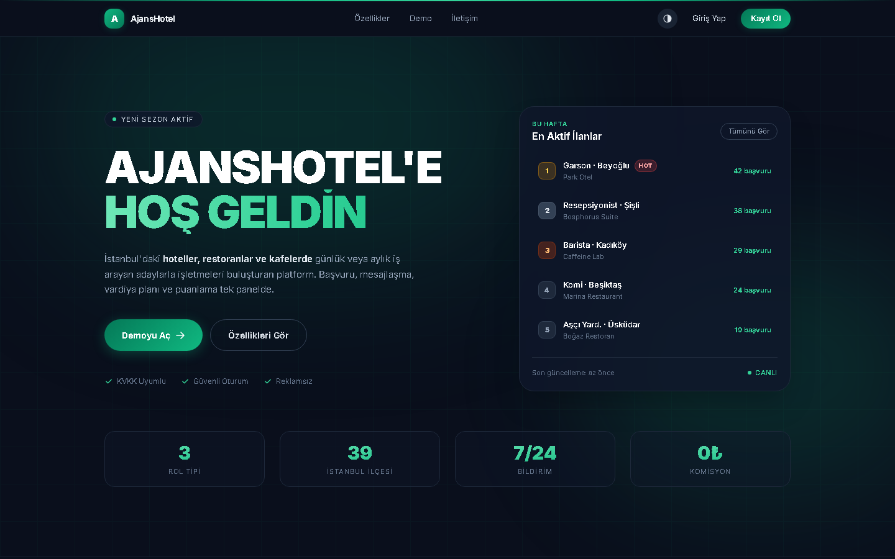
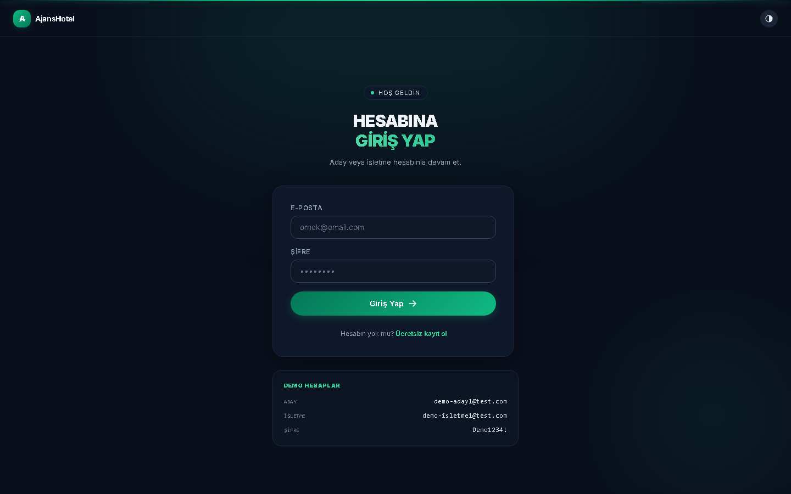
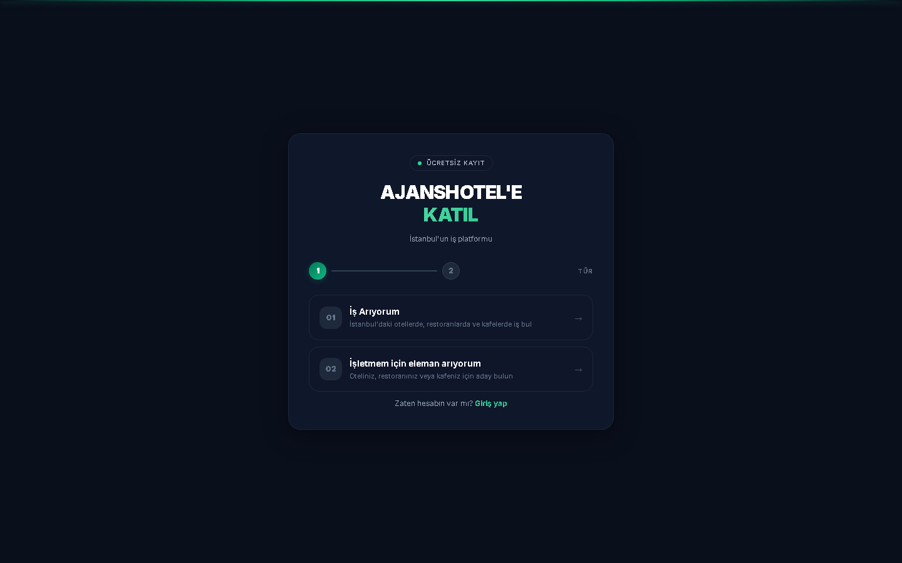
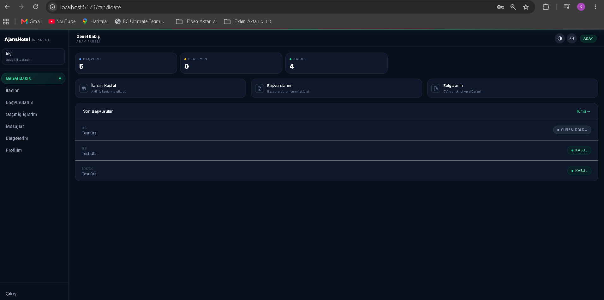
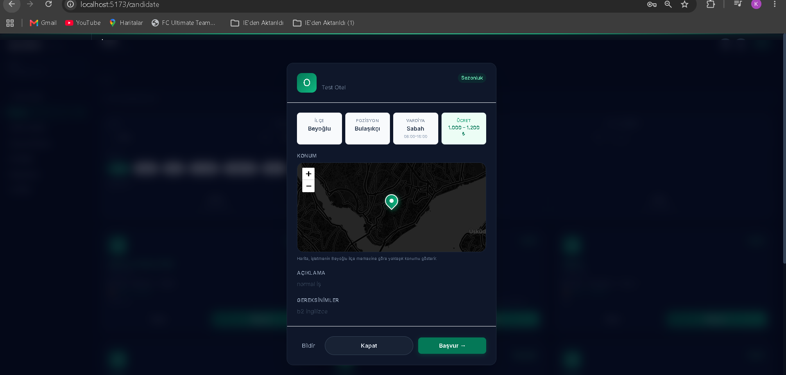
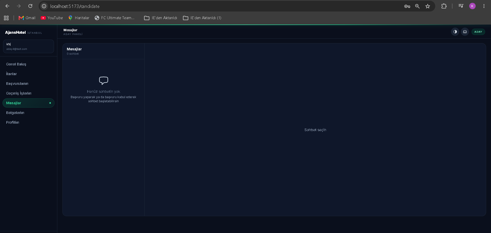
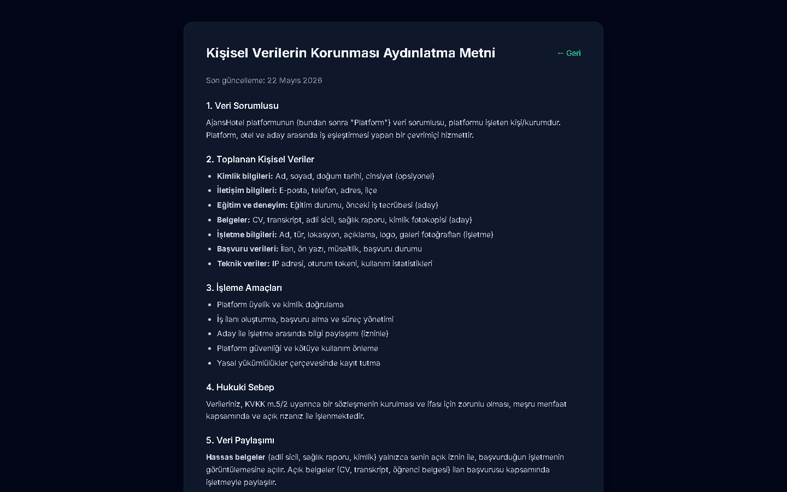

<div align="center">

# AjansHotel

**İstanbul'daki hotel, restoran ve kafelerde günlük/aylık iş arayan adaylarla işletmeleri buluşturan platform.**

Başvurudan çalışmaya kadar tüm süreç tek ekranda: ilan açma → vardiya planı → başvuru → mesajlaşma → puanlama.

[](https://github.com/calsgnkadir/hotel-platform/actions/workflows/ci.yml)

[](#hızlı-başlangıç-docker)
[](#arayüz-önizleme)
[](#lisans)


</div>

---

## Hızlı Başlangıç (Docker)

Tüm stack tek komutla ayağa kalkar — MySQL + Spring Boot + React, kurulum derdi yok:

```bash
git clone https://github.com/calsgnkadir/hotel-platform.git
cd hotel-platform
cp .env.example .env
docker compose up --build
```

| Servis | Adres |
| :----- | :---- |
| Arayüz | <http://localhost:5173> |
| API + Swagger | <http://localhost:8080/swagger-ui/index.html> |
| MySQL | `localhost:3307` (yereldeki 3306 ile çakışmaz) |

İlk açılışta demo verisi otomatik yüklenir; aşağıdaki hesaplarla giriş yapabilirsin.

> **Yerel geliştirme (Docker'sız):** backend `hotelapp/` → `mvn spring-boot:run`,
> frontend `hotel-web/` → `npm install && npm run dev`. MySQL 8 ve `.env` gerekir.

---

## Arayüz Önizleme

🌐 **<https://hotel-platform-seven.vercel.app/>** — yalnızca **arayüz** önizlemesi.

> [!IMPORTANT]
> **Bu çalışan bir demo değil, sadece arayüz.** Backend yayında değil; giriş,
> ilan listeleme, mesajlaşma gibi veri gerektiren hiçbir akış bu adreste
> çalışmaz. Uygulamanın tamamını çalışır görmek için tek yol
> [Docker adımları](#hızlı-başlangıç-docker) — 3 servis de ayağa kalkar, demo
> verisi otomatik yüklenir.

**Neden canlı bir backend yok?** Barındırma denemesi (Railway) sona erdi ve
yerine ücretsiz katman aramak yerine bilinçli bir tercih yapıldı: çalışmayan bir
"Canlı Demo" linki, hiç link olmamasından kötüdür. Backend'i ayağa kaldırmak
isteyen için deploy tarifi hazır ve test edilmiş —
[`docs/DEPLOY_FLY.md`](docs/DEPLOY_FLY.md) + [`deploy/fly/`](deploy/fly).
Aynı imajlar herhangi bir VPS'te `docker compose up` ile de çalışır.

### Demo Hesaplar

| Rol      | E-posta                    | Şifre        |
| :------- | :------------------------- | :----------- |
| Aday     | `demo-aday1@test.com`      | `Demo1234!`  |
| İşletme  | `demo-isletme1@test.com`   | `Demo1234!`  |

> Demo verisi `@Profile("demo")` ile idempotent olarak yüklenir — 9 başvuru, 3 işletme, 12 ilan içerir.

### 60 Saniyede Tur

> Docker ile ayağa kaldırdıktan sonra <http://localhost:5173> üzerinde:

1. **Aday olarak giriş yap** → İlanlar'da vardiya bazlı bir ilana başvur
2. **"Bugün müsaitim"** anahtarını aç — acil ilanlarda önceliklisin
3. **Çıkış → İşletme olarak giriş yap** → gelen başvuruyu **Kabul Et** / **Yedeğe Al** / **Reddet**
4. Bir ilanı **Acil** işaretle → o an müsait adaylara anında bildirim gider
5. **Mesajlar**'da aday ile WebSocket üzerinden canlı yazış
6. **Analitik**'te dönüşüm, işe alım süresi ve durum dağılımını gör

---

## Ekran Görüntüleri

> [!WARNING]
> **Aşağıdaki görseller güncel değil.** 8 Haziran 2026'da, arayüz açık-teal
> tasarıma geçirilmeden önce çekildiler; koyu/neon temayı gösteriyorlar.
> Güncel arayüz için [Vercel önizlemesine](https://hotel-platform-seven.vercel.app/)
> bak veya [Docker ile](#hızlı-başlangıç-docker) kendin çalıştır.
> Yeniden çekim rehberi: [`docs/screenshots/README.md`](docs/screenshots/README.md)

### Landing — hero + canlı vardiya nabzı

<p align="center"></p>

### Auth — Giriş + Kayıt

<table>
<tr>
<td width="50%"><b>Giriş</b><br/></td>
<td width="50%"><b>Kayıt — Rol Seçimi</b><br/></td>
</tr>
</table>

### Aday Paneli — genel bakış + kompakt stat şeridi

<p align="center"></p>

### İlan Detayı — Vardiya + ücret + **canlı harita** (#81)

<p align="center"></p>

### Mesajlaşma — 5 saniye polling + listing context

<p align="center"></p>

### KVKK — Aydınlatma metni

<p align="center"></p>

> **İşletme paneli (`business-applications.png`)** eklenecek — demo işletme hesabıyla
> Gelen Başvurular ekranı (Kanban + A4 kart listesi) çekildiğinde buraya girer.
> (Eski listede geçen `stats.png` düştü: Analitik sekmesi projeden kaldırıldı.)

---

## Özellikler

### Aday Tarafı

- **Vardiya bazlı başvuru** — Tek bir ilana birden fazla vardiya seçeneğiyle başvuru
- **Belge yönetimi** — CV, transkript, adli sicil, sağlık raporu (Cloudinary)
- **Hassas belge izni** — Kimlik/adli sicil sadece **açık rıza** ile işletmeye açılır
- **Akıllı sıralama** — İlanlar tercihine göre puanlanır (position/district/jobType/recency); "sana özel" default listing sıralaması
- **Kayıtlı Aramalar** — Filtre setini kaydet; yeni eşleşen ilan gelince otomatik bildirim (30 dk scan)
- **Tercih bazlı eşleştirme** — İlgi alanına uygun ilan açılınca otomatik bildirim
- **Geçmiş işlerim** — Çalışılmış vardiyalar + saat toplamı + puanlama hakkı
- **Çift yönlü puanlama** — İşletmeye yıldız + yorum

### İşletme Tarafı

- **Vardiya editörü** — Tarih + saat + ihtiyaç sayısı, drag-drop sıralı galeri
- **Başvuru iş akışı** — Bekliyor → İnceleniyor → Kabul / Red
- **No-show takibi** — 2 hatadan sonra otomatik 30 günlük ban
- **Belge talep sistemi** — Aday'a tek tek belge isteme
- **İstatistik panosu** — Donut, bar chart, kabul oranı, ortalama yanıt süresi
- **Bizde çalışanlar** — Geçmiş çalışma kaydı + toplam saat

### Sistem

- **Mesajlaşma** — Sohbet + listing context + WebSocket real-time + okundu bilgisi
- **Bildirim sistemi** — 13 bildirim tipi (`MATCHING_LISTING` dahil), WebSocket push + Web Push (VAPID) + in-app dropdown
- **Outbox pattern** — Email + audit log async publish, at-least-once delivery + retry (max 5 attempt)
- **Şikayet sistemi** — Kullanıcı bildir + admin moderasyon
- **Audit log** — Ban / no-show / şikayet işlemleri loglanır
- **Admin paneli** — Kullanıcı yönetimi + şikayet inceleme + işlem geçmişi
- **Editorial dark luxe UI** — Warm graphite + champagne + ivory palet, tek font (Inter 400/500/600/700), unified rounded-2xl card sistemi, hairline separators, muted status colors (sage/brick/ochre — no neon)
- **KVKK uyumlu** — Açık rıza akışı + aydınlatma metni

---

## Mimari

```
┌──────────────┐   HTTPS / WSS    ┌──────────────────┐
│  Frontend    │ ◄──────────────► │     Backend      │
│  (nginx)     │  /api/*  · /ws   │                  │
│  React 18    │      CORS        │  Spring Boot 3.2 │
│  Vite 5      │                  │  Java 17         │
│  Tailwind 3  │                  │  Hibernate 6.4   │
│  Recharts    │                  │  STOMP/WebSocket │
└──────────────┘                  └────────┬─────────┘
      :5173                          :8080 │ JDBC
                                           ▼
                                  ┌──────────────────┐
                                  │   MySQL 8        │
                                  │   (volume)       │
                                  └──────────────────┘
        └──────── docker compose: 3 servis, tek ağ ────────┘

                ┌──────────────────┐
                │   Cloudinary     │  ◄── Belge + foto yükleme
                │   (CDN + DAM)    │      (signed URL)
                └──────────────────┘
```

### Proje Yapısı

```
hotel-platform/
├── hotelapp/                  Spring Boot backend
│   ├── controller/            REST endpoint'leri
│   ├── service/               İş mantığı
│   ├── repository/            JPA + Specification
│   ├── entity/                JPA entities
│   ├── dto/                   Request/Response DTO'lar
│   ├── security/              JWT + RateLimit filter
│   ├── config/                CORS + Security + Cloudinary
│   └── seeder/                DemoSeeder (idempotent)
│
├── hotel-web/                 React frontend
│   ├── src/
│   │   ├── pages/             Landing, Auth, Candidate, Business, Admin
│   │   ├── components/        DashboardLayout, ThemeToggle, NotificationBell ...
│   │   ├── context/           Auth + Theme
│   │   ├── api/               Axios client + endpoint helpers
│   │   └── utils/             Validation, formatters
│   └── tailwind.config.js     Neon brand palette
│
└── README.md                  Bu dosya
```

---

## Tech Stack

| Katman          | Teknoloji                                        |
| :-------------- | :----------------------------------------------- |
| **Backend**     | Spring Boot 3.2, Java 17, Hibernate 6.4, JWT     |
| **Database**    | MySQL 8 (Hibernate ORM, Specification API)       |
| **Storage**     | Cloudinary (belge + foto, signed URL)            |
| **Frontend**    | React 18, Vite 5, React Router 6, React Hook Form|
| **Styling**     | Tailwind 3 (dark mode + neon palette)            |
| **Grafikler**   | Recharts (PieChart, AreaChart, BarChart)         |
| **Auth**        | JJWT (HS256) + Spring Security                   |
| **Rate Limit**  | Bucket4j                                         |
| **Validation**  | Hibernate Validator + react-hook-form            |
| **Container**   | Docker + Compose (MySQL + backend + nginx)       |
| **CI**          | GitHub Actions — push/PR'da build + test (259 backend, 86 frontend) |

---

## Lokal Kurulum

### Gereksinimler

- Java 17+ (`java -version`)
- MySQL 8 (`mysql --version`)
- Node 18+ (`node -v`)
- IntelliJ IDEA önerilir (Maven wrapper stub olduğu için)

### 1) Veritabanı

```sql
CREATE DATABASE hotel_platform CHARACTER SET utf8mb4 COLLATE utf8mb4_turkish_ci;
```

### 2) Backend

```bash
cd hotelapp
cp .env.example .env
# .env dosyasını doldur: DB_PASSWORD, JWT_SECRET (32+ char), CLOUDINARY_*
```

IntelliJ'de `HotelStudentPlatformApplication`'ı çalıştır → http://localhost:8080

> **Swagger UI:** <http://localhost:8080/swagger-ui.html>

### 3) Frontend

```bash
cd hotel-web
npm install
npm run dev
```

Tarayıcı: <http://localhost:5173>

### Demo verisini yükle (opsiyonel)

`.env` içinde `SPRING_PROFILES_ACTIVE=demo` yap, backend'i restart et. İlk açılışta 3 işletme + 5 aday + 12 ilan + 9 başvuru otomatik gelir (idempotent).

---

## Deploy

### Docker (önerilen — her ortamda aynı)

Backend ve frontend container'lanmıştır; `docker-compose.yml` tam stack'i tanımlar.
Herhangi bir container platformuna (Render, Fly.io, Koyeb, kendi VPS'in) aynı
imajlarla taşınabilir:

```bash
docker compose up --build -d      # tüm stack
docker compose logs -f backend    # log takibi
docker compose down               # durdur (veri volume'de kalır)
```

Ortam değişkenleri `.env` üzerinden geçilir (`.env.example`'a bak): `DB_PASSWORD`,
`JWT_SECRET`, opsiyonel `CLOUDINARY_URL`, `GOOGLE_CLIENT_ID/SECRET`, `RESEND_API_KEY`.

### Veritabanı migration'ları

Şema **Flyway** ile kurulur (`FLYWAY_ENABLED=true`); Hibernate `ddl-auto=validate`
ile yalnızca doğrular — şema entity'lerle uyuşmazsa uygulama hiç açılmaz. Docker
stack'i de bu yolu kullanır, yani yerelde çalıştırdığın şey production yolunun aynısı.

<details>
<summary><b>V4 checksum notu</b> — bu repoyu daha önce çalıştırdıysan oku</summary>

`V4__version_columns_default.sql` idempotent hâle getirildi. Eski hâli
`applications.version` kolonunu koşulsuz `MODIFY` ediyordu; o kolonu V1 baseline
oluşturmadığı için **sıfırdan kurulan her veritabanında** zincir
`Unknown column 'version'` ile patlıyor ve uygulama ayağa kalkmıyordu. Artık
`information_schema` kontrolüyle korumalı: temiz şemada atlanır, eski şemada
eskisi gibi uygulanır.

Bu, dosyanın checksum'ını değiştirdi. **V4'ü daha önce uygulamış** bir
veritabanın varsa uygulama şu hatayla açılmaz:

```
Migration checksum mismatch for migration version 4
-> Applied to database : -1231884147
-> Resolved locally    : -638485747
```

İki seçenek:

**A) Mevcut veriyi koru — geçmiş tablosundaki checksum'ı güncelle** (tek seferlik):

```bash
mysql -uroot -p hotel_platform -e "UPDATE flyway_schema_history SET checksum = -638485747 WHERE version = '4';"
```

Windows'ta `mysql` genelde PATH'te olmaz. **PowerShell** kullanıyorsan tırnaklı
yolu çalıştırmak için başına `&` (call operator) koyman gerekir, yoksa
`Unexpected token '-uroot'` hatası alırsın:

```powershell
& "C:\Program Files\MySQL\MySQL Server 8.0\bin\mysql.exe" -uroot -p hotel_platform -e "UPDATE flyway_schema_history SET checksum = -638485747 WHERE version = '4';"
```

**cmd.exe**'de `&` gerekmez, yolu doğrudan tırnak içinde yaz.

> `-p`'den sonra parola yazma — komut sana sorar.
>
> Bu, `flyway repair`'in checksum uyuşmazlığı için yaptığı işin aynısı.
> `flyway-maven-plugin` bu projenin `pom.xml`'inde tanımlı değil, o yüzden
> `mvn flyway:repair` çalışmaz — doğrudan SQL kullan.

**B) Şemayı sıfırdan kur** (demo verisi zaten seeder'dan gelir):

```bash
docker compose down -v && docker compose up -d
```
</details>

### Yönetilen platformlar

- **Frontend (Vercel):** kök dizin `hotel-web/`, build `npm run build`, output `dist`,
  `VITE_API_URL` = backend adresi.
- **Backend (Fly.io):** hazır `fly.toml`'lar + adım adım rehber →
  [`docs/DEPLOY_FLY.md`](docs/DEPLOY_FLY.md). Küçük makinelerde JVM heap'i sıkı tut:
  `JAVA_TOOL_OPTIONS=-XX:MaxRAMPercentage=70 -XX:+UseSerialGC`.

### GitHub Actions

- `ci.yml` — **her push/PR'da** backend `mvn verify` + frontend test/build
- `daily-health-check.yml` — uptime + auth smoke testi, `status.md`'ye rapor yazar.
  **Cron şu an kapalı, yalnızca elle tetikleniyor:** hedeflediği backend adresi ölü
  olduğu için her sabah 404 raporu commit'liyordu. Canlı bir backend ayağa kalkınca
  geri açılacak (bkz. `docs/DEPLOY_FLY.md` → adım 6).

---

## Önemli Endpoint'ler

| Endpoint                              | Method | Rol        | Açıklama                  |
| :------------------------------------ | :----- | :--------- | :------------------------ |
| `/api/auth/register`                  | POST   | -          | Kayıt                     |
| `/api/auth/login`                     | POST   | -          | Giriş (JWT döner)         |
| `/api/candidate/profile`              | GET    | CANDIDATE  | Aday profili              |
| `/api/business/listings`              | POST   | BUSINESS   | İlan oluştur (vardiyalı)  |
| `/api/applications/{id}/decide`       | PUT    | BUSINESS   | Kabul/Red                 |
| `/api/applications/{id}/no-show`      | POST   | BUSINESS   | No-show işaretle          |
| `/api/conversations`                  | GET    | *          | Sohbetler                 |
| `/api/notifications`                  | GET    | *          | Bildirimler               |
| `/api/business/stats`                 | GET    | BUSINESS   | Donut + bar verisi        |
| `/api/candidate/stats`                | GET    | CANDIDATE  | Kabul oranı + yanıt süresi|
| `/api/admin/users`                    | GET    | ADMIN      | Kullanıcı listesi         |
| `/api/reports`                        | POST   | *          | Şikayet oluştur           |
| `/api/listings?ranked=true`           | GET    | CANDIDATE  | Weighted ranking (sana özel sıralama) |
| `/api/saved-searches`                 | GET/POST | CANDIDATE| Kayıtlı aramalar listesi + oluştur |
| `/api/saved-searches/{id}`            | PATCH/DELETE | CANDIDATE | Bildirim toggle / sil |
| `/api/public/pulse`                   | GET    | -          | Landing canlı vardiya nabzı |

Tam liste: <http://localhost:8080/swagger-ui.html>

---

## Sorun Giderme

**Backend başlamıyor, `Access denied`** → `.env` içindeki `DB_PASSWORD` doğru mu?

**Frontend açılıyor ama API hatası** → Backend 8080'de çalışıyor mu? Network sekmesinde CORS hatası var mı?

**Port 8080 dolu** → `.env`'de `SERVER_PORT=8090`, `vite.config.js`'te proxy hedefini güncelle.

**`./mvnw: Permission denied` (Mac/Linux)** → `chmod +x hotelapp/mvnw`

**`AVG(...) Object` Hibernate hatası** → `ApplicationRepository.avgResponseSecondsForCandidate` için `CAST AS double` kullanıldı (hotfix `0add1c7`).

**Lokal Hibernate SQL log gürültüsü** → Dev config (`application-dev.yml`) default olarak SQL log'unu kapalı tutar. Belirli bir sorguyu tek seferlik görmek için: `JPA_SHOW_SQL=true mvn spring-boot:run` (veya IntelliJ'de env var ekle).

**OutboxRelay + LandingPulse çok sık sorgu atıyor** → Dev'de scheduler'lar sakinleşti (Outbox 15 sn, Pulse 60 sn). Prod default'ları 5 sn / 30 sn — dev override'ları `application-dev.yml`'de `app.outbox.relayDelayMs` + `app.pulse.intervalMs`.

---

## Yol Haritası

### Tamamlanan
- [x] Vardiya bazlı ilan + başvuru
- [x] Mesajlaşma + bildirimler (WebSocket + Web Push)
- [x] Çift yönlü puanlama
- [x] Cloudinary entegrasyonu
- [x] Dashboard istatistikleri (Recharts)
- [x] Email + şifre sıfırlama (Resend SMTP + Outbox pattern)
- [x] Harita konum gösterimi (Leaflet + OpenStreetMap)
- [x] **Kayıtlı Aramalar** — kullanıcı filtre setini kaydeder, yeni eşleşmede bildirim (scheduled matcher, 30 dk)
- [x] **Akıllı sıralama** — aday tercihlerine göre weighted ranking (position +50, district +30, jobType +20, recency +10)
- [x] **Editorial dark luxe UI** — warm graphite + champagne + ivory palet, tek font ailesi (Inter), unified rounded-2xl card sistemi
- [x] Landing "Vardiya Nabzı" canlı widget (WebSocket broadcast)

### Sıradaki
- [ ] Test coverage (backend unit + frontend vitest + E2E Playwright)
- [ ] Metrics dashboard (Grafana / Prometheus)
- [ ] Public rate-limit ayrı tier (anonim read için, k6 baseline ~1 req/s)
- [ ] Sanal liste (react-window) — 1000+ kayıt için

---

## Lisans

MIT © 2026 [calsgnkadir](https://github.com/calsgnkadir)
